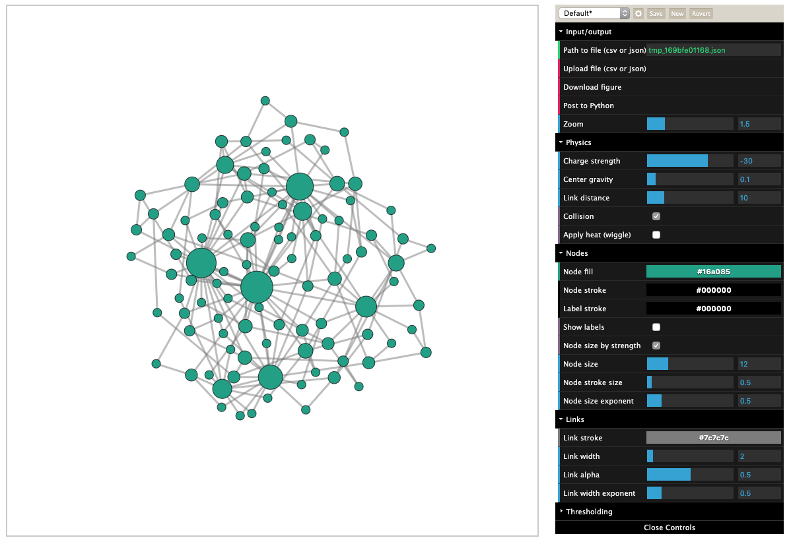

About this project
==================

Netwulf is an interactive visualization engine for networkx_ Graph-objects.
Unlike other visualization methods, it is neither slow, nor does it rely
to install any crude dependencies. On top, fine-tuning visualizations 
is made simple due to the interactive visualization nature and reproducing visualizations
is made possible thanks to seamless communication between Python and the
visualization tool.

Quick example
-------------

.. code:: python

    import networkx as nx
    from netwulf import visualize

    G = nx.barabasi_albert_graph(100,2)

    visualize(G)

    
    started visualization

Why should I use netwulf
------------------------

Pros
~~~~

- interactive styling of network visualizations in the browser, started from Python
- no compiling needed
- no external program needed 
- cross-platform
- seamlessly use the inferred style back in Python
- redraw the visualization in Python using matplotlib

Cons
~~~~

- no multiedges yet
- no rendering of directed edges

Install
-------

::

   pip install netwulf

Bug reports & contributing
--------------------------

You can contribute to the `public repository`_ and raise issues there.

.. _`public repository`: https://github.com/benmaier/netwulf
.. _networkx: https://networkx.github.io/

