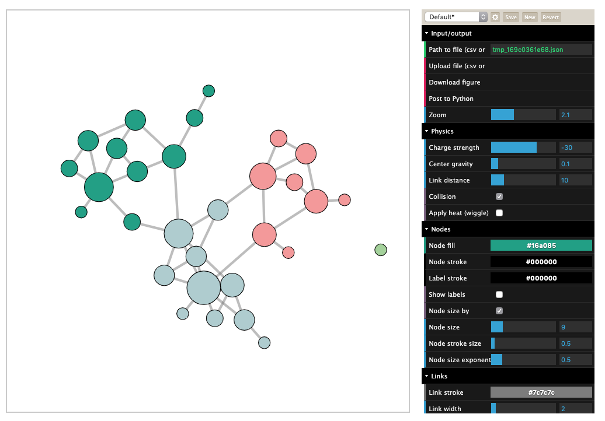

Visualize Groups
----------------

Cluster a network and visualize it with groups.

.. code:: python

    import networkx as nx
    import community
    import netwulf as wulf

    G = nx.random_partition_graph([10,10,10],.25,.01)
    bb = community.best_partition(G)  # dict of node-community pairs
    nx.set_node_attributes(G, bb, 'group')

    wulf.visualize(G)

    colored partition
