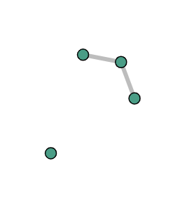
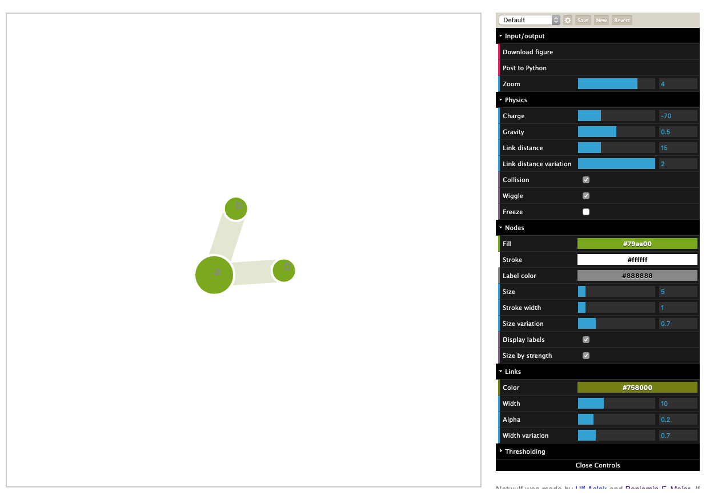
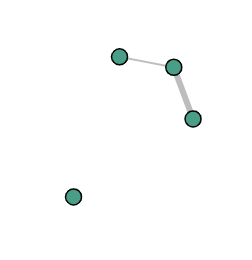
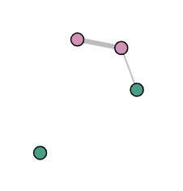
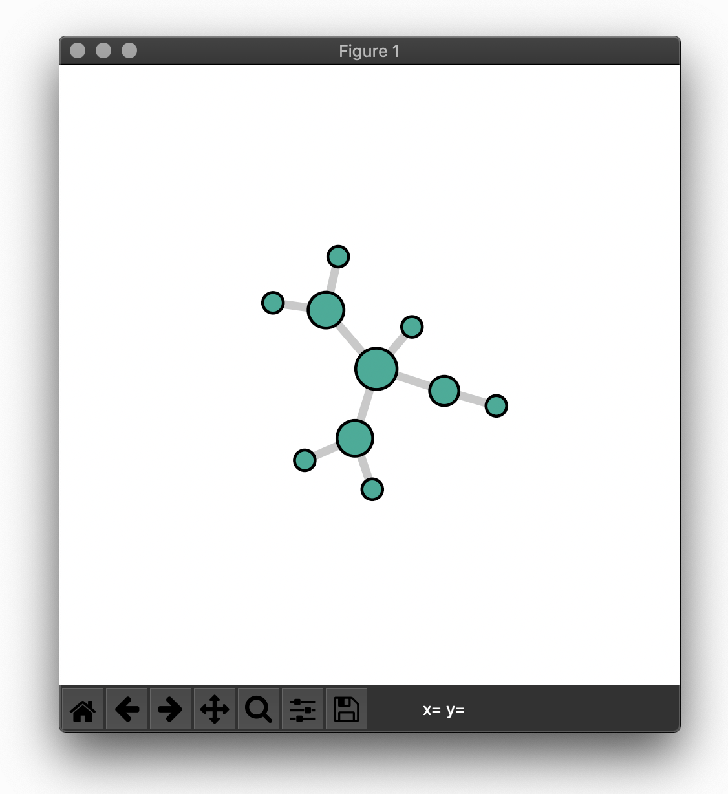

.. _testing:

Testing
=======

Usage
-----

We're using ``pytest`` and ``pytest-cov`` to test and produce test reports.
In order to obtain those, change to the root directory of the repository and run

.. code:: bash
    
    make test

You will be confronted with an automated test (opened browser windows will close themselves) and
with an output looking like this

.. code:: bash

	---------- coverage: platform darwin, python 3.7.3-final-0 -----------
	Name                        Stmts   Miss  Cover
	-----------------------------------------------
	netwulf/__init__.py             4      0   100%
	netwulf/interactive.py        154     24    84%
	netwulf/metadata.py             9      0   100%
	netwulf/tests/__init__.py       1      0   100%
	netwulf/tests/test_all.py      70      2    97%
	netwulf/tools.py               92      1    99%
	-----------------------------------------------
	TOTAL                         330     27    92%
	
	================ 5 passed, 4 warnings in 58.81 seconds ================

If you open a pull request, make sure you ran the tests and copy the test report
as a comment with your pull request like so

.. code::
    
    ```
    COPY-PASTED REPORT OUTPUT
    ```

Tests
-----

You can run the tests manually, as described in the following.
Each of the functions explained below will produce output that you have
to expect to see in the automated testing above, as well.

First, the test class has to be initiated like this

.. code:: python

    from netwulf.tests import Test

    T = Test()

Posting
~~~~~~~

Test the posting functionality first.

.. code:: python

    T.test_posting()

A browser window will be opened with a visualization looking like this.



    Posting test

It will close automatically.

Config
~~~~~~~

The config test starts a visualization with a configuration where each entry differs from its default value.

.. code:: python

    T.test_config_adaption()

A browser window will be opened with a visualization looking like this.



    Posting test

It will close automatically. The test checks wether the returned configuration is equal to the posted configuration.

Reproducibility
~~~~~~~~~~~~~~~

The reproducibility feature should work like this

1. Open a network visualization
2. stylize network
3. retrieve stylized network and configs
4. bind retrieved positions to network
5. start new visualization with bound positions and config
6. the new visualization should be exactly the same as the old visualization

Run a test like this

.. code:: python

    T.test_reproducibility()

A browser window will be opened with a visualization looking like this.


    Reproducibility test 1

It will close automatically. Afterwards, the positions will be bound to the graph object and the visualization will be restarted which should look exactly like the first visualization:


    Reproducibility test 2

Then the second visualization will close automatically, too.

Filtering
~~~~~~~~~

The filtering test constructs a network with two edges of two different edge weight attributes. In the first test, the network is filtered for the first edge weight attribute. In the second test, it is filtered for the second attribute and also assigns a group attribute to the nodes. Start the test like this:

.. code:: python

    T.test_filtering()

A browser window will be opened with a visualization looking similar to this:



    Filtering test 1

It will close automatically. Afterwards, groups and edge weight attributes will be changed and a second visualization will be started, looking similar to this:



    Filtering test 2

Note that the second color will probably not be pink, as it is randomly assigned each time. The second visualization window will close automatically, too.

Matlotlib redrawing
~~~~~~~~~~~~~~~~~~~

A stylized network is supposed to be reproduced by the function :mod:`netwulf.tools.draw_netwulf`. Start the test like this

.. code:: python

    T.test_matplotlib()

The resulting figure should look like this:




    matplotlib test 1

Data I/O
~~~~~~~~

A stylized network is supposed to be saved and loaded by the functions in the module :mod:`netwulf.io`. Start the test like this

.. code:: python

    T.test_io()

The test network will be styled in netwulf, saved, loaded and then redrawn in matplotlib. Hence the figure should look like the netwulf visualization.
