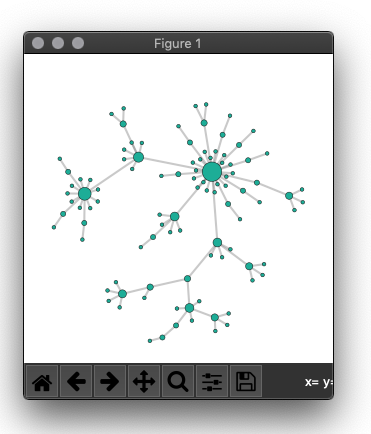

Reproducing the figure in Python
--------------------------------

Once retrieved, the stylized network data can be used
to reproduce the figure in Python. To this end you can use
the function :mod:`netwulf.tools.draw_netwulf`.

.. code:: python

    import networkx as nx
    import netwulf as wulf

    G = nx.barabasi_albert_graph(100,1)

    stylized_network, config = wulf.visualize(G)

    import matplotlib.pyplot as plt
    fig, ax = wulf.draw_netwulf(stylized_network)
    plt.show()

A visualization window is opened and the network can be stylized.
Once you're done, press the button `Post to Python`. Afterwards,
the figure will be redrawn in matplotlib and opened.

    Reproduced figure

In order to add labels, use ``matplotlib``'s text function.
Node positions and labels are saved in the stylized network, so
for the first node this might look like

.. code:: python

    ax.text(
            network_properties['nodes'][0]['x'],
            network_properties['nodes'][0]['y'],
            network_properties['nodes'][0]['id']
           )
