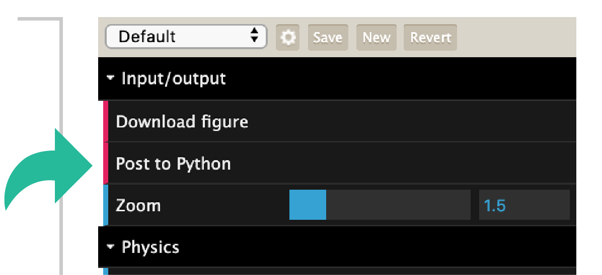
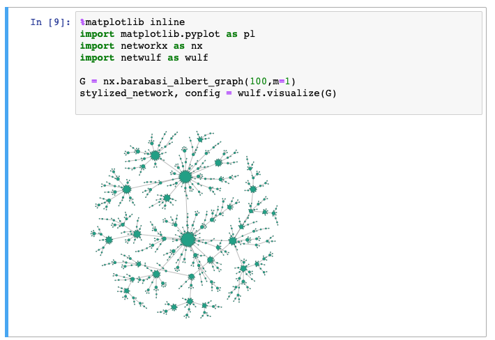

Use network style in Python
---------------------------

The network data tuned by the visualization can be posted back
to Python. The visualization function can actually return 
two dictionaries, the first containing information about the stylized
network, the second containing information about the 
visualization control configuration.

Start a visualization like this

.. code:: python

    import networkx as nx
    import netwulf as wulf

    G = nx.barabasi_albert_graph(100,2)

    stylized_network, config = wulf.visualize(G)

A visualization window is opened and the network can be stylized.
Once you're done, press the button `Post to Python`.

Pressing this button will pipe the data back to Python and close the browser
The Python kernel is busy until either `Post to Python` is clicked or a
``KeyboardInterrupt`` signal is send (manually or using the `Stop`-Button 
in a Jupyter notebook).

The returned stylized network dictionary will contain all the necessary information
to reproduce the figure. It will look something like this.

.. code:: python

    stylized_network = {
        'xlim': [0, 833],
        'ylim': [0, 833],
        'linkColor': '#7c7c7c',
        'linkAlpha': 0.5,
        'nodeStrokeColor': '#000000',
        'nodeStrokeWidth': 0.75,
        'links': [
            {'source': 0, 'target': 2, 'width': 3},
            {'source': 0, 'target': 3, 'width': 3},
            {'source': 0, 'target': 4, 'width': 3},
            {'source': 1, 'target': 2, 'width': 3},
            {'source': 1, 'target': 3, 'width': 3},
            {'source': 1, 'target': 4, 'width': 3}
        ],
        'nodes': [
            {'id': 0,
             'x': 436.0933431058901,
             'y': 431.72418500564186,
             'radius': 20,
             'color': '#16a085'},
            {'id': 1,
             'x': 404.62184898400426,
             'y': 394.8158724310507,
             'radius': 20,
             'color': '#16a085'},
            {'id': 2,
             'x': 409.15148692745356,
             'y': 438.08415417584683,
             'radius': 20,
             'color': '#16a085'},
            {'id': 3,
             'x': 439.27989436871223,
             'y': 397.14932001193233,
             'radius': 20,
             'color': '#16a085'},
            {'id': 4,
             'x': 393.4680683212157,
             'y': 420.63184247673917,
             'radius': 20,
             'color': '#16a085'}
        ]
    }

Furthermore, the configuration dictionary 
which was used to generate this figure will resemble

.. code:: python

    default_config = {
        # Input/output
        'zoom': 1.5,
        # Physics
        'node_charge': -30,
        'node_gravity': 0.1,
        'link_distance': 10,
        'node_collision': False,
        'wiggle_nodes': False,
        'freeze_nodes': False,
        # Nodes
        'node_fill_color': '#16a085',
        'node_stroke_color': '#000000',
        'node_label_color': '#000000',
        'display_node_labels': False,
        'scale_node_size_by_strength': False,
        'node_size': 10,
        'node_stroke_width': 0.5,
        'node_size_unevenness': 0.5,
        # Links
        'link_color': '#7c7c7c',
        'link_width': 5,
        'link_alpha': 0.5,
        'link_width_unevenness': 0.5,
        # Thresholding
        'display_singleton_nodes': False,
        'min_link_weight_percentage': 0,
        'max_link_weight_percentage': 100
    }

If the visualization was started from a Jupyter notebook, a picture of the stylized
network will appear in the cell below.

    Stylized network in a Jupyter notebook.

In order to reproduce this visualization, you may want to call the visualization function
again with, passing the produced configuration.

.. code:: python

    wulf.visualize(G, config=config)
