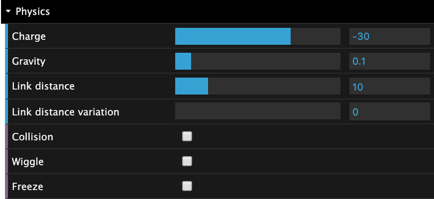
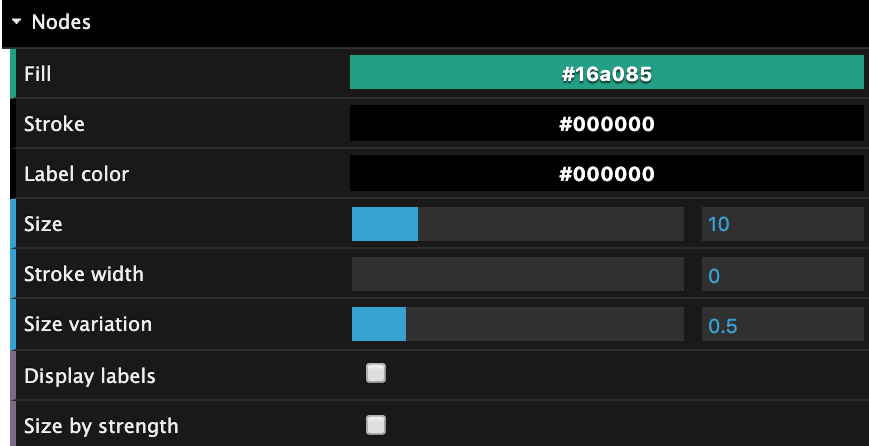
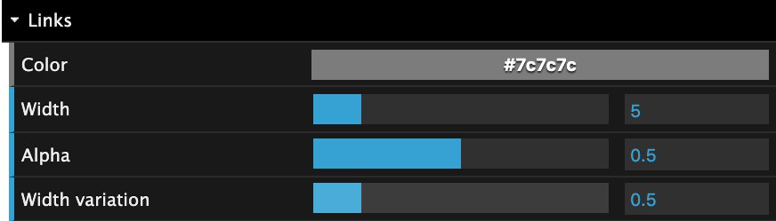
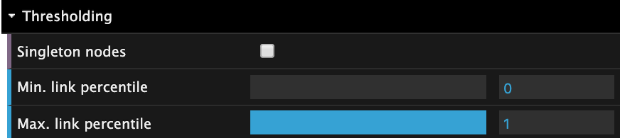

Interactive Visualization
-------------------------

The interactive visualization gives the user an intuitive interface through which to manipulate and style their networks. Most of the parameters are intuitive, and each one has a short tooltip explanation that
is revealed upon hovering. The control panel is scrollable and sections can be collapsed. 

Physics
~~~~~~~

The network layout is computed using the `d3-force <https://github.com/d3/d3-force>`_ module. In the interactive visualization users can control its three main parameters:

* *Charge*: Implemented with the `d3.forceManyBody <https://github.com/d3/d3-force#forceManyBody>`_. The lower (more negative) the charge the more nodes, like electrons, repel each other.
* *Gravity*: Implemented with the `d3.forceManyBody <https://github.com/d3/d3-force#forceManyBody>`_. Gravity pulls nodes towards the canvas center. Zero gravity lets connected components and single nodes float away entirely.
* *Link distance*. Implemented with `d3.forceLink <https://github.com/d3/d3-force#forceLink>`_. Sets the optimal distance of links. 

The user is *not* given control over the `link.strength <https://github.com/d3/d3-force#link_strength>`_ because changing it from default rarely benefits the layout (though, in `an earlier version <https://github.com/ulfaslak/network_styling_with_d3/tree/9b7b403500ad565577e8d7fc2ba2df8dd09052a0>`_ the 'Link strength exponent' was a control parameter that users could tweak to change variation in link strengths).

Other physics parameters are:

* *Link distance variation*. Shortens the optimal distance of strong links. This is mostly useful in sparse networks as the link strengths in dense networks are small. Works well when link distance is large.
* *Collision*: Implemented with `d3.forceCollide <https://github.com/d3/d3-force#forceCollide>`_ with default strength (0.7) and makes overlapping nodes more unlikely.
* *Wiggle*: Sets the simulation *alphaTarget* to 1, causing nodes to move more freely. Useful for "wiggling" nodes out of place if the layout seems stuck in a local minumum.
* *Freeze*: Stops the force simulation. The simulation is restarted when this is untoggled. When the network nodes have initial positions (given as node-attributes "x" and "y"), "Freeze" is enabled at launch, so that the initial positions are respected.

Nodes
~~~~~

* *Fill*: The color of nodes. If nodes have a "group" attribute, each group had its own random color, and changing *Fill* changes the colors of all groups continuously. Users, therefore, *cannot* control the exact colors that groups have inside of the interaction visualization. If this is desired, the "group" attribute should be an accepted color suck as "red" or "#4b23df".
* *Stroke*: The color of the ring around each node.
* *Label color*: Specified the color of labels. Labels are only visible if they are toggled or if nodes are clicked.
* *Size*: The size of the largest node.
* *Stroke width*: Width of the ring around each node.
* *Size variation*: The variation of node sizes. Makes larger nodes larger and smaller nodes smaller. Only effective when nodes have a "size" attribute, or *Size by strength* is toggled.
* *Display labels*: Display all node labels. Then untoggled, *all* node labels are cleared, also on nodes that were clicked.
* *Size by strength*: Compute the strength of each node (i.e. weighted degree), and size each node by this value. If untoggled, nodes are either uniformly sized or sized after the "size" attribute optionally specified on each node.

Links
~~~~~

* *Color*: The color of links.
* *Width*: The width of the widest link. Widths are scaled by the "weight" attribute, optionally specified on each link.
* *Alpha*: The transparency level of links. Useful in large dense networks.
* *Width variation*: The variation of link widths. Only effective when "weight" attributed are specified on each link.

Thresholding
~~~~~~~~~~~~

* *Singleton nodes*: Display nodes that are not connected to any other nodes. Per default this is untoggled.
* *Min. link percentile*: The lower threshold on link weights. Thresholds on percentiles and not actual weights (since link weight distributions are often heavy-tailed). For example, if *Min. link percentile* is 0.25, the 25% weakest links are removed.
* *Max. link percentile*: The upper threshold on link weights.

Online version
~~~~~~~~~~~~~~

An online version of the interactive visualization exists here_.
It allows users to upload or specify a URL to a network in either JSON or CSV format.
JSON formatted networks have at minimum two keys: "nodes" and "links".
Each contains a list with nodes and links, respectively.
See our example JSON_ and CSV_ files.
In the online version, users can save, export and reset parameter presets using the top bar control panel:

It's useful if you have found a style you like and want save it for later.
What you can do then, is click 'New' and give that parameter preset a name.
When you load a new network (or close the browser and come back) your browser will remember those values.
If you want to export your preset as JSON, you can click the "gears" icon.

.. _here: https://ulfaslak.com/works/network_styling_with_d3/index.html
.. _JSON: https://gist.githubusercontent.com/ulfaslak/6be66de1ac3288d5c1d9452570cbba5a/raw/0b9595c09b9f70a77ee05ca16d5a8b42a9130c9e/miserables.json
.. _CSV: https://gist.githubusercontent.com/ulfaslak/66a0baa60b6fe1a5e4cc0891b2b1017d/raw/1cba9e4fbf3d0cec7c6c4f0ff6ab3fb54609f2d3/miserables.csv